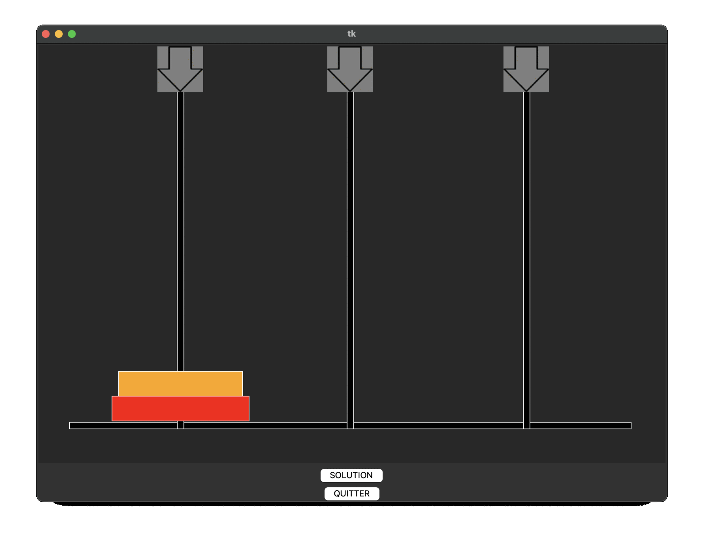

# English
---
# Towers-of-Hanoi

### Example for 2 Rings


## 📑 Table of Contents
[ℹ️ About](#-about)  
[✅ Features](#-features)  
[🛠️ Installation](#-installation)   
[📄 License](#-license)

## ℹ️ About
This is a project made by me (Jean1000) when I was in high school. I learnt about the Tower of Hanoi, and how to solve problems through code. This project put to a challenge my problem solving skills. 
Play the towers of hanoi or solve them

## ✅ Features
- Graphic interface
- Play and try to solve the puzzle
- Computer solves the problem
- From 3 to 8 disks

## 🛠️ Installation

### 1. Prerequisites
- python3.10 or above
- pip
- create a new folder
- cd path/to/your/folder
- nothing more, YAYY XD

### 2. Download
#### In any shell, or PowerShell for Windows
bash 
```
git clone git@github.com:Jean1000levrai/Towers-of-Hanoi.git
cd Towers-of-Hanoi
python3 -m venv .venv
source .venv/bin/activate    # windows: .venv\Scripts\Activate.ps1
pip install -r requirements.txt
   ```

### 3. Launch it and Play!
bash
```
cd path/to/your/folder
cd src   # don't forget this
python3 main.py
```

## 📄 License
This project is licensed under the MIT License — see the LICENSE file for details.


